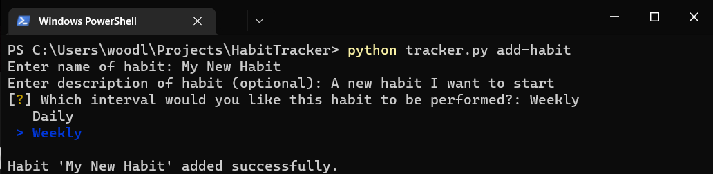
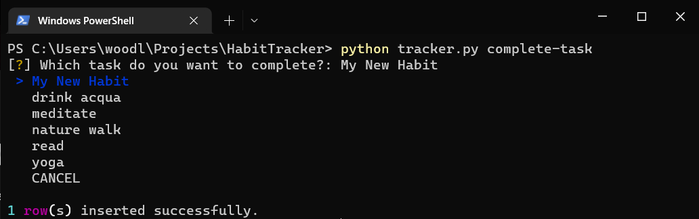
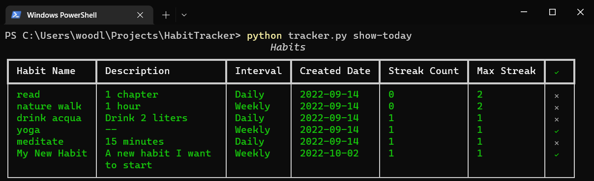

# Habit Tracker App
## What is it?
A CLI (command-line interface) for adding, tracking and modifying your habits!

Create, delete, modify and analyze your habits with an easy-to-use command-line interface (CLI) right from your PC.
This lightweight application helps you create new habits and hold yourself accountable, while also making it fun by
tracking your streaks.

## How to install
Copy or clone the repository to your local machine.  If you have GitHub CLI installed, you can use the following 
command:
```
gh repo clone woodleyj/HabitTracker
```
There are a few external libaries which need to be installed in order to use HabitTracker.  They can be installed
with the following command:
```
pip install -r requirements.txt
```
## Getting Started
When the CLI is first run using ``python tracker.py`` from the project directory it will create the **main.db** file
and populate it with 5 starter habits.  These can be added upon or removed as the user sees fit.

### Adding Your First Habit
Add a new habit using ``python tracker.py add-habit``

Enter the name of the habit, description, and select the interval in which you would like to perform the habit.



### Completing Your First Task
After performing the habit you can mark it complete for the day/week by running ``python tracker.py complete-task``

Select the task you would like to complete:



### Viewing Your Habits
You can see which habits still need to be performed and get habit information at a glance using ``python tracker.py show-today``

The last column conveniently shows whether or not the task has been completed for the current time period.



## Usage
To show the list of available commands, run: ``python tracker.py``

### Arguments
The basic syntax for all the arguments:
``
python tracker.py <argument>
``

``add-habit``

- Prompts the user for the name, description, and interval of the habit and saves to the database.

``analyze-habit``

- Allows the user to filter for only Daily or Weekly habits, as well as see the streak information.  Max streak overall
and streak for a selected habit are supported.

``complete-task``

- After a habit is performed it should be checked off using the complete-task argument.  This provides a list of currently
tracked habits to choose from and allows the user to select one to complete using the arrow keys.

``delete-habit``

- Prompts the user to select a habit to delete from the database.

``display-history``

- Displays the history for all of the habits that have been performed.

``interactive``

- Run the CLI in interactive mode.  Allows the user to perform multiple tasks in the app without having to run additional
commands.  Program runs in a loop while the user selects the different options using the arrow keys.  EXIT is then 
selected to exit the application.

``modify-habits``

- Allows for modification of habit name, description, and/or interval.

``show-today``

- Shows all the currently tracked habits along with relevant information, such as streak info and if the task has been
completed today/this week.

## Further Information
### Intervals and Streaks
The application keeps track of the streak using two different time frames depending on the user's preference.  This is
performed at runtime, and the deadline for the task is set differently according to the interval.

For **Daily** tasks, the app checks the history to see if the task has been performed yesterday or today.  If it has
not been performed today yet, it will show a grey 'x' in the completion column.  If it was performed yesterday, the
streak (if one exists) is maintained.  If the task goes uncompleted today then the streak will be reset.  The deadline
is therefore 23:59:59 each day, and it **not** matter *when* the task was completed during the day - **the deadline will 
remain 23:59:59 the following day.**

For **Weekly** tasks it works the same as daily, except I chose to use week numbers from ISO.  The deadline to complete
a weekly task is therefore 23:59:59 of the last day of the following ISO calendar week, and just as with the daily 
tasks, it does *not* matter when the task was completed during the week - the deadline remains the same.

### Limitations and Drawbacks
There is currently no mechanism for checking if newly-created habits match any of the old, deleted habits.  Because
of this, some strange behavior can occur for example if a habit is completed, then deleted, then recreated with the same
name.  The streak count will be lost, however it will still show that the new habit was completed today. An
implementation to check this could be beneficial and may be added in a further update.

## Tests
To test the modules/functions, run the following command from the root directory:
```
pytest .
```